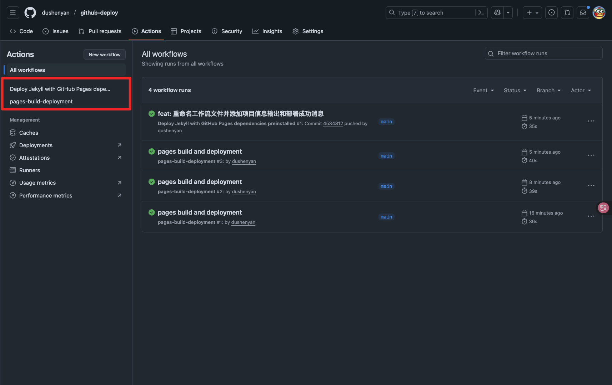
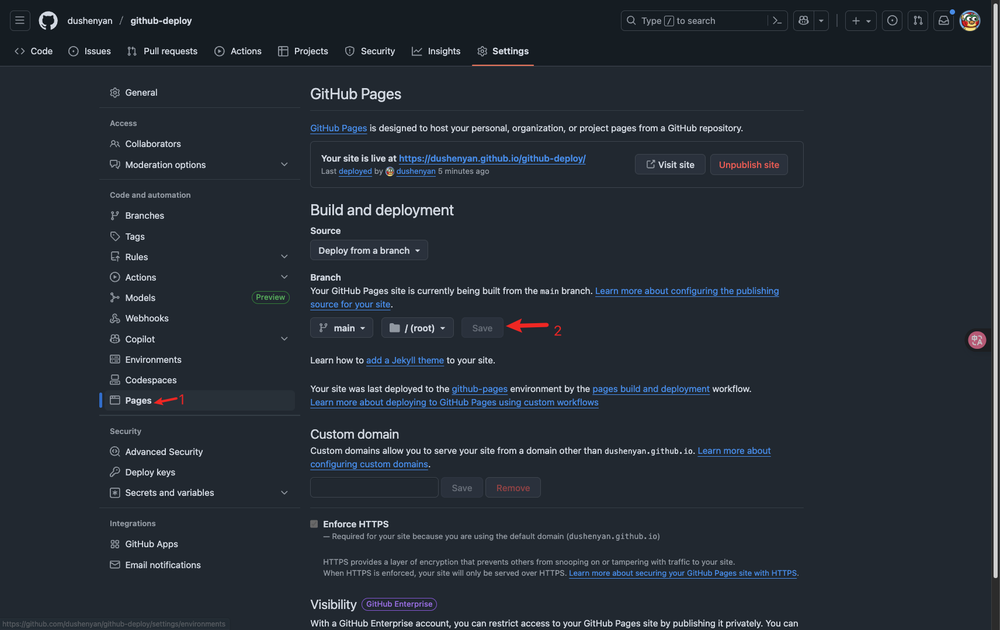

# github-deploy

<a href="https://dushenyan.github.io/github-deploy/" class="read-more">查看网站 &#8594;</a>

### 项目介绍

使用github为网站提供部署服务以及部署流进程运行

保证项目仓库必须是**public**状态

1. 开启github pages服务 

action服务配置文件

2. 调整部署目录

### 相关链接

- [项目地址](https://github.com/dushenyan/github-deploy)
- [feather SVG库](https://feathericons.com/)
- [阮一峰的网络日志](https://www.ruanyifeng.com/blog/2019/09/getting-started-with-github-actions.html)

